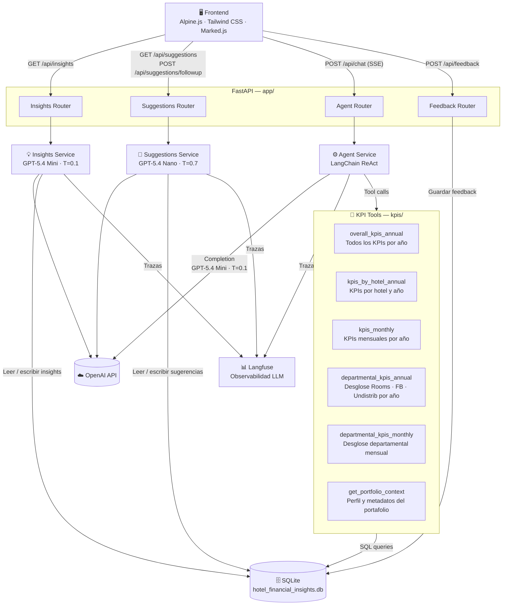

# Arquitectura del Sistema

## Visión general

El sistema transforma datos financieros hoteleros en insights accionables y conversación inteligente. Está compuesto por cinco módulos funcionales independientes que comparten una base de datos SQLite centralizada y se exponen a través de una API REST.

---

## Diagrama de módulos

---

## Flujos principales

### Arranque del servidor
Al iniciar, el servidor ejecuta `load_insights()`. Si la tabla de insights está vacía, llama al motor de insights para generarlos a partir de los KPIs y los persiste en SQLite. Coste cero en reinicios posteriores.

### Conversación (chat)
1. El frontend envía `message + history + insights` al endpoint `/api/chat`.
2. El Agent Router construye el agente en tiempo de petición, inyectando los insights activos como contexto adicional en el system prompt.
3. El agente ejecuta un bucle ReAct: razona, llama herramientas KPI, observa resultados y genera la respuesta.
4. La respuesta se transmite token a token mediante **Server-Sent Events (SSE)**.

> El agente es **stateless**: se construye por petición a partir del estado que propaga el frontend. No hay estado compartido entre workers.

### Insights
- `GET /api/insights` → lee de SQLite; si está vacío, genera vía LLM.
- `POST /api/insights/refresh` → borra insights y sugerencias, regenera ambos.
- Los insights se propagan desde el frontend al agente en cada mensaje, garantizando coherencia sin estado servidor.

### Sugerencias
- `GET /api/suggestions` → sugerencias iniciales basadas en KPIs (cacheadas en DB).
- `POST /api/suggestions/followup` → genera 3 preguntas de seguimiento contextuales usando los últimos 10 mensajes de la conversación.

### Feedback
`POST /api/feedback` persiste la valoración (👍/👎), comentario opcional, contenido del mensaje evaluado e historial de los últimos 10 mensajes.

---

## Base de datos — `hotel_financial_insights.db`

| Tabla | Contenido |
|---|---|
| `pnl` | Datos financieros mensuales por hotel y escenario (REAL/BUDGET) |
| `hotels` | Metadatos del portafolio (país, categoría, habitaciones) |
| `insights` | Insights generados por LLM (cacheados) |
| `suggestions` | Sugerencias iniciales generadas por LLM (cacheadas) |
| `feedback` | Valoraciones de usuarios por mensaje |

---

## Decisiones de diseño destacadas

| Decisión | Justificación |
|---|---|
| Agente stateless | Seguridad en entornos multi-worker; sin estado compartido entre peticiones |
| Insights propagados desde el frontend | Permite que el agente siempre tenga los insights vigentes sin consultar la DB en cada petición |
| Un único fichero SQLite | Simplicidad operativa; suficiente para el volumen del PoC |
| SSE para streaming | Mejora la percepción de velocidad en respuestas largas del agente |
| Módulo aislado por dominio | Cada módulo gestiona su router, servicio y acceso a DB de forma independiente |
